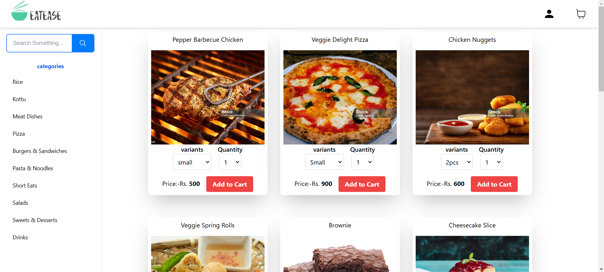
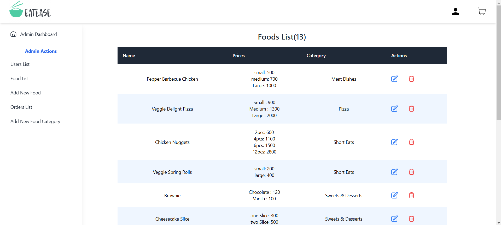
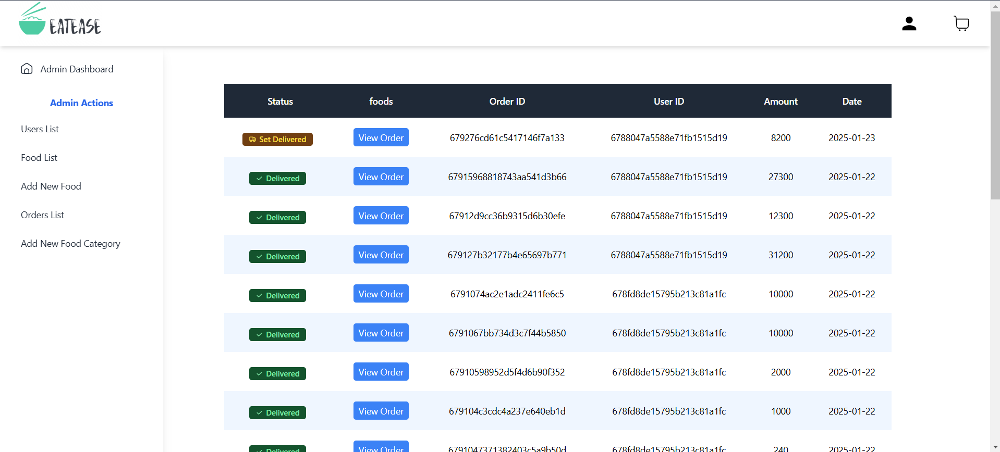
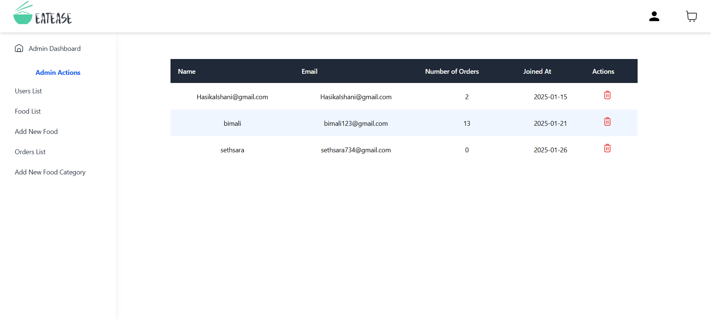

# Restaurant Online Order System(EatEase)

## Project Description

The Restaurant Online Order System is a web application that allows users to browse the menu, place orders, and manage their accounts. Admins can manage food items, view orders, and handle user accounts.

## User Interface

This is how the user sees the web page:



## Admin Interface

### Admin Food List

This is how the admin sees the list of all food items:



### Admin Orders List

This is how the admin sees all orders:



### Admin Users List

This is how the admin sees all users who have created an account:



## Setup Instructions

### Backend Setup

1. Clone the repository:
    ```sh
    git clone https://github.com/rashmikanaveen/restaurant-online_order-system.git
    ```
2. Navigate to the backend directory:
    ```sh
    cd restaurant-online_order-system/backend
    ```
3. Install the dependencies:
    ```sh
    npm install
    ```
4. Create a `.env` file and add the necessary environment variables:
    ```sh
    touch .env
    ```
    Example:
    ```env
    DATABASE_URL=your_database_url
    DB_PASSWORD=your_db_password
    DB_NAME=your_db_name
    MONGODB_URI=your_mongodb_url
    STRIPE_SECRET=your_stripe_secret
    JWT_SECRET=your_jwt_secret
    ```
5. Run the backend server:
    ```sh
    nodemon start
    ```

### Frontend Setup

1. Navigate to the frontend directory:
    ```sh
    cd ../frontend
    ```
2. Install the dependencies:
    ```sh
    npm install
    ```
3. Create a `.env` file and add the necessary environment variables:
    ```sh
    touch .env
    ```
4. Run the frontend server:
    ```sh
    npm run dev
    ```

## License

This project is licensed under the MIT License.
